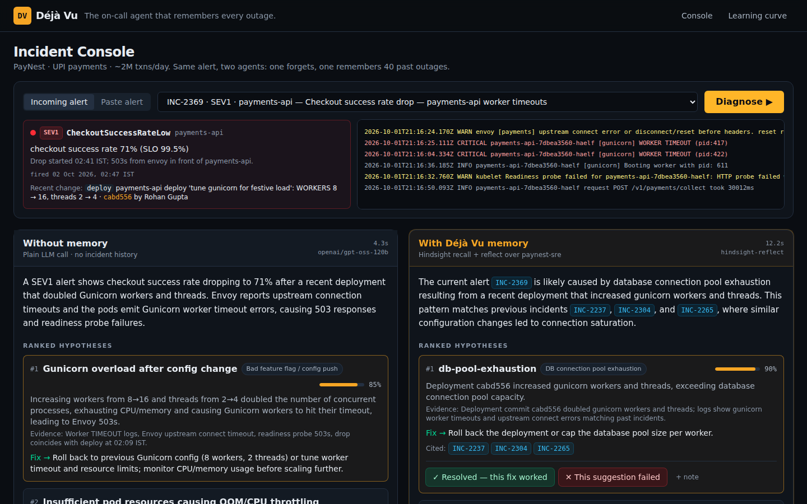
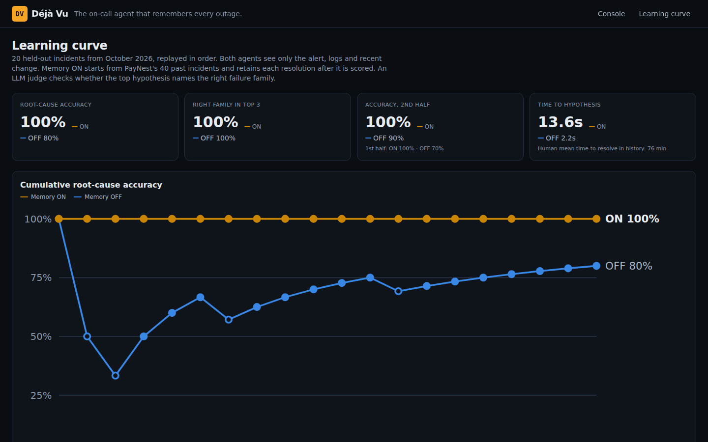
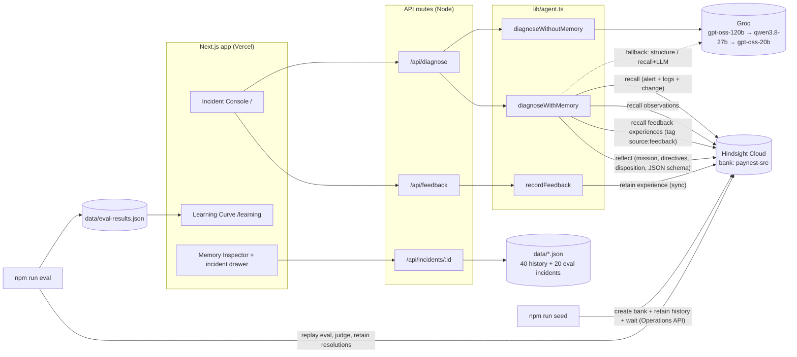

# Déjà Vu — the on-call agent that remembers every outage

> When production breaks, Déjà Vu recalls how every similar incident was diagnosed and fixed before, ranks the most likely root cause with **cited past incidents**, warns you about **fixes that already failed**, tells you **who fixed it last time** — and learns from every resolution, so it gets measurably better over time.

Built for the **"AI Agents That Learn Using Hindsight"** hackathon on [Hindsight](https://hindsight.vectorize.io) memory + Groq.

<!-- Screenshots / demo GIF -->
| Incident console (memory OFF vs ON) | Learning curve |
|---|---|
|  |  |

_60-second demo GIF: `docs/demo.gif` (placeholder)._

---

## The problem

Every engineering org with an on-call rotation re-learns the same outages. The knowledge of *"last time payments-api threw 5xx after a worker bump, restarting pods didn't help — Priya capped the pool size"* lives in a post-mortem nobody reads at 2:47am, or in the head of someone who is asleep. Generic LLM assistants don't help: they don't know **your** systems, **your** past incidents, or **which fixes already failed**.

Déjà Vu is an incident console, not a chatbot. The same alert is diagnosed twice, side by side:

- **Without memory** — a strong LLM with no history (Groq `openai/gpt-oss-120b`). Plausible, generic.
- **With Déjà Vu memory** — Hindsight recall + reflect over PayNest's incident history. Specific, cited, and aware of what failed before.

## 60-second demo

1. *"It's 2:47am. Checkout success rate is dropping. You're on call."* — pick **INC-2369** and hit **Diagnose**.
2. **Without memory** (e.g.): "Gunicorn overload, raise pod CPU limits." **With Déjà Vu:** "DB pool exhaustion — deploy `cabd556` doubled workers; same as INC-2237 / INC-2304. Restarting pods FAILED in INC-2292 and INC-2357. Page Priya Raman — she resolved 4 of these."
3. Open the **Memory Inspector**: the exact world facts, experiences and consolidated observations used, with recall scores. Click any `INC-xxxx` to open the past incident.
4. Click **"✕ This suggestion failed"** on the top fix → **Re-run**. The failed fix moves to *Known-failed fixes*, and a different proven fix is recommended. A purple "What changed" banner shows the diff.
5. Open **Learning curve**: 20 held-out incidents replayed chronologically — memory ON vs OFF.

## Architecture



Code layout (small, typed modules):

| File | Responsibility |
|---|---|
| `lib/llm.ts` | Groq client: per-call timeout, 2 retries with backoff (honours `retry-after`), model fallback chain, request spacing for free-tier limits, **zod-validated JSON with one repair turn** |
| `lib/hindsight.ts` | Official `@vectorize-io/hindsight-client` wrapper: bank config (mission/directives/disposition), retain, recall, reflect, Operations API polling |
| `lib/agent.ts` | Memory OFF / ON diagnosis pipelines and the feedback → experience loop |
| `lib/eval.ts` | LLM-judge scoring and result summaries |
| `lib/seed.ts` | Seeds a bank with history and waits for processing |
| `lib/incidents.ts` | Data loading, alert/document rendering |
| `lib/types.ts` | Shared types + the `Diagnosis` zod schema and its JSON-Schema twin |
| `scripts/generate-data.ts` | Deterministic incident generator (seeded PRNG) |

## How Hindsight memory is used

| Hindsight feature | Where | What it does in Déjà Vu |
|---|---|---|
| **Memory bank** | `paynest-sre` (`lib/hindsight.ts → configureBank`) | One bank holds PayNest's entire on-call memory. Eval runs in an isolated `paynest-sre-eval` bank. |
| **Mission** | bank `reflectMission` | *"I am the on-call SRE memory for PayNest's payments platform. I prioritise past incidents, root causes, what fixed them, what did not, and who fixed them."* A `retainMission` tells extraction to keep incident IDs, failed fixes and resolvers; an `observationsMission` steers consolidation toward per-service failure patterns. |
| **Directives** | `createDirective` ×3 | "Always cite past incident IDs for any claim." · "Never recommend destructive commands (DROP, rm -rf, force failover of primary) without flagging them as requiring human approval." · "If a fix previously failed for a similar incident, say so explicitly." — visible in the UI as citations, **needs human approval** badges and the *Known-failed fixes* list. |
| **Disposition** | `updateBankConfig` | Skepticism 5, literalism 5, empathy 3 — the agent distrusts coincidental changes and sticks to what the record says. |
| **Retain (world)** | `npm run seed` | Each of the 40 historical incidents is retained as a document (`document_id = INC-xxxx`) with its real timestamp, a context string, and tags `service:*`, `family:*`, `incident:*`, `source:history`. Retained async; the script waits via the **Operations API** + bank stats until extraction and consolidation finish. |
| **Retain (experience)** | `/api/feedback` → `recordFeedback` | "✓ this fix worked" / "✕ this suggestion failed" (+ note) is retained **synchronously** as a first-person agent experience, tagged `source:feedback`, `outcome:*`, `service:*`, `incident:*`. |
| **Retain (learning in eval)** | `npm run eval` | After each eval incident is scored, its resolution is retained into the memory-ON bank — so later incidents can use it. |
| **Recall** | `diagnoseWithMemory` | The alert + logs + recent deploy are used as the recall query (`budget: mid`, `maxTokens: 3000`, types world/experience/observation). A second tag-filtered recall (`tags: [source:feedback]`, `any_strict`) fetches on-call verdicts. Results populate the **Memory Inspector** with type, date and score. |
| **Reflect** | `diagnoseWithMemory` | Produces the diagnosis with the bank's mission, directives and disposition, using `response_schema` for structured output (ranked hypotheses with confidence and cited INC ids, next checks, known-failed fixes, suggested expert) and `include.facts` so the inspector shows the facts reflect actually used. Feedback verdicts are passed in explicitly so failed fixes are demoted. |
| **Observations** | recall `types: [observation]` | Consolidated, per-service patterns ("payments-api pool exhaustion follows worker/replica bumps; restarts don't help") shown in the inspector's *Observations* tab and used by reflect. |
| **Mental models** | _P1 — not built_ | Planned "Living Runbook" per service refreshed after each resolution. |

## Resilience

- **LLM:** every Groq call has a timeout, 2 retries with exponential backoff / `retry-after`, a fallback model chain, and zod validation with one repair turn. JSON mode is dropped automatically if a model rejects it.
- **Hindsight:** if reflect's structured output is missing/invalid, its markdown answer is structured by Groq; if reflect fails entirely, the agent diagnoses from recalled memories via Groq. Warnings are surfaced in the UI rather than crashing it.
- **UI:** loading skeletons, empty states, per-column error states, feedback errors inline.

> Note: the spec's fallback model `qwen/qwen3-32b` is no longer served on Groq (`404 model_not_found`), so the chain is `openai/gpt-oss-120b → qwen/qwen3.8-27b → openai/gpt-oss-20b`.
> Hindsight reflect's `response_schema` rejects JSON-Schema union types (`["string","null"]` → HTTP 500), so the schema uses empty strings for "none".

## Learning curve result

From `npm run eval` (`data/eval-results.json`, 20 held-out Oct 2026 incidents, replayed chronologically, LLM-judged on failure-family match):

| | Memory OFF (plain Groq) | Memory ON (Déjà Vu) |
|---|---|---|
| Top-1 root-cause accuracy | **80%** (16/20) | **100%** (20/20) |
| Right family anywhere in top 3 | 100% | 100% |
| Past incidents cited per answer | 0 | 7.6 |
| Accuracy, first 10 → last 10 incidents | 70% → 90% | 100% → 100% |
| Avg time to hypothesis | 2.2 s | 13.6 s |

Historical human mean time-to-resolve in `data/history.json` is ~76 min, so a cited hypothesis in ~14 s is the relevant comparison — the extra latency of memory buys a correct, sourced answer.

**What the numbers say, honestly:** memory ON did not need to "climb" on this set — the 40-incident history already covers all six families, so it was right from the first incident, and the gap vs memory OFF comes from the four incidents with misleading symptoms, which the memory-less agent got wrong:

| Incident | Ground truth | Memory OFF said | Memory ON said |
|---|---|---|---|
| INC-2369 | DB pool exhaustion | "Gunicorn overload" (raise CPU limits) | DB pool exhaustion after worker bump, citing past worker-bump incidents |
| INC-2371 | NPCI bank timeout (Axis) | DB pool exhaustion in upi-gateway | NPCI bank timeout — ignored the coincidental flag push |
| INC-2387 | Redis eviction storm (festive sale) | DB pool exhaustion | Redis eviction storm & cache stampede |
| INC-2411 | NPCI bank timeout (SBI) | Logging-library upgrade → GC pressure | SBI remitter-bank degradation |

The within-run learning mechanism (retaining each resolution after scoring) and the feedback loop are exercised by the eval and the console respectively; a harder eval with families absent from history would be needed to show a rising memory-ON curve.

## Data

Fictional **PayNest** — an Indian UPI payments startup (~2M txns/day). Services `payments-api`, `upi-gateway`, `ledger-svc`, `auth-svc`, `notif-worker`, `postgres-primary`, `redis-cache`, `kafka`. On-call: Priya Raman, Arjun Mehta, Sneha Kulkarni, Rahul Verma, Fatima Sheikh, Karthik Iyer.

- `data/history.json` — 40 incidents, Mar–Sep 2026, from 6 recurring families (DB pool exhaustion, Redis eviction storm, NPCI/bank timeout, Kafka consumer lag, expired TLS / rotated secret, bad flag/config push). Each has a Prometheus-style alert, realistic log lines, the preceding change (sha + author), an on-call chat timeline, root cause, fix that worked, 0–2 fixes that failed, resolver, TTR and a post-mortem. Generated deterministically by `npm run gen-data`.
- `data/eval.json` — 20 held-out incidents (Oct 2026) with different surface symptoms, several with **red herrings** (a flag push right before an NPCI outage, DB-pool errors that are really a Redis stampede, an "all banks down" that is actually our expired mTLS client cert).

## Setup

```bash
npm install
cp .env.example .env.local   # fill in keys
npm run check                # verify Groq + Hindsight connectivity
npm run seed                 # create/configure paynest-sre and retain history (~3-5 min)
npm run dev                  # http://localhost:3000
```

Deploy on Vercel: import the repo and set the env vars below. `data/eval-results.json` is committed, so `/learning` works without running the eval.

### Environment variables

| Var | Description |
|---|---|
| `GROQ_API_KEY` | Groq API key |
| `HINDSIGHT_API_KEY` | Hindsight Cloud API key |
| `HINDSIGHT_API_URL` | e.g. `https://api.hindsight.vectorize.io` |
| `HINDSIGHT_BANK_ID` | defaults to `paynest-sre` |

### Scripts

| Script | What it does |
|---|---|
| `npm run check` | Connectivity check for Groq and Hindsight |
| `npm run gen-data` | Regenerate `data/history.json` + `data/eval.json` (deterministic) |
| `npm run seed` | Create/configure the bank, retain history, wait for ops. Idempotent. `-- --reset` recreates the bank; `-- --clear-feedback` removes demo feedback memories |
| `npm run eval` | Seed an isolated `paynest-sre-eval` bank, replay the 20 eval incidents (memory OFF vs ON), LLM-judge them, retain each resolution, write `data/eval-results.json`. `-- --limit N` for a quick run |
| `npm run build` / `start` | Production build / server |

## License

MIT
